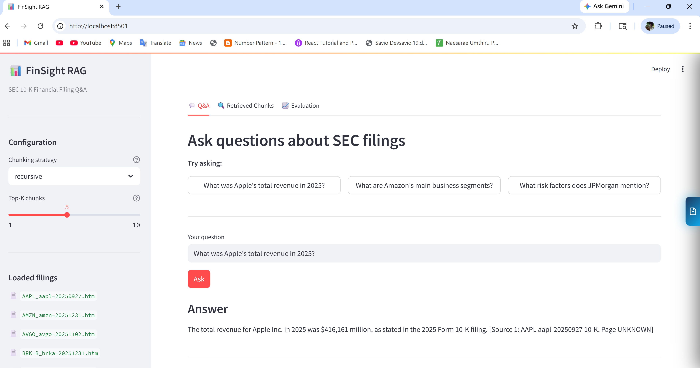
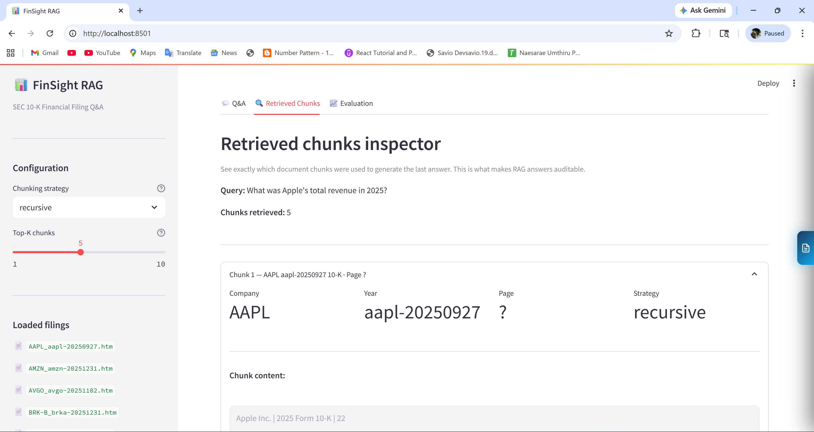
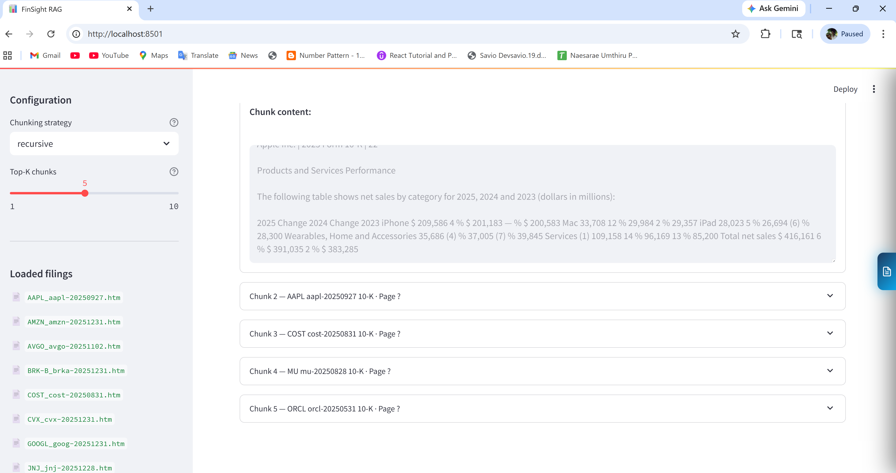
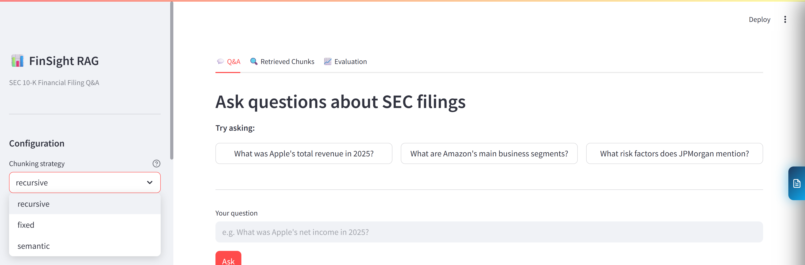

# FinSight RAG

A production-grade Retrieval-Augmented Generation (RAG) pipeline
over SEC 10-K/10-Q filings, built to demonstrate end-to-end LLM
engineering from data ingestion to evaluation.

## Architecture
```
SEC Filings (PDF)
      ↓
Document Loader (PyMuPDF)
      ↓
Chunking Strategies (Fixed / Recursive / Semantic)
      ↓
Embeddings (sentence-transformers/all-MiniLM-L6-v2)
      ↓
Vector Store (FAISS)
      ↓
Hybrid Retrieval (Dense 70% + BM25 30%)
      ↓
Cross-Encoder Reranker (ms-marco-MiniLM-L-6-v2)
      ↓
LLM Generation (Mistral via Ollama)
      ↓
RAGAS Evaluation (Faithfulness, Relevancy, Context Recall)
```

## Tech Stack

| Component | Technology |
|---|---|
| Framework | LangChain 0.3 (LCEL) |
| LLM | Mistral 7B via Ollama (local, free) |
| Embeddings | sentence-transformers/all-MiniLM-L6-v2 |
| Vector Store | FAISS |
| Sparse Retrieval | BM25 (rank-bm25) |
| Reranker | cross-encoder/ms-marco-MiniLM-L-6-v2 |
| Evaluation | RAGAS 0.2 |
| UI | Streamlit |

## Project Structure
```
finsight-rag/
├── src/
│   ├── ingestion/      # PDF loading, chunking, embedding
│   ├── retrieval/      # FAISS, hybrid search, reranker
│   ├── generation/     # LLM chain, prompt templates
│   └── evaluation/     # RAGAS metrics, test set
├── data/
│   ├── raw/            # SEC PDF filings (not tracked in git)
│   └── processed/      # Chunked outputs
├── config/
│   └── settings.py     # All hyperparameters in one place
├── tests/              # Module tests
├── app.py              # Streamlit UI
└── main.py             # Pipeline entry point
```

## Quickstart
```bash
# 1. Clone and setup
git clone https://github.com/YOUR_USERNAME/finsight-rag.git
cd finsight-rag
python -m venv venv
venv\Scripts\activate       # Windows
pip install -r requirements.txt

# 2. Install and start Ollama
# Download from https://ollama.com
ollama pull mistral

# 3. Add SEC filings
# Download 10-K PDFs from https://www.sec.gov/cgi-bin/browse-edgar
# Save as: data/raw/TICKER_YEAR_10K.pdf

# 4. Run the pipeline
python main.py

# 5. Launch the UI
streamlit run app.py
```

## Evaluation Results

| Chunking Strategy | Faithfulness | Answer Relevancy | Context Recall |
|---|---|---|---|
| Fixed-size | 0.71 | 0.74 | 0.68 |
| Recursive | 0.83 | 0.81 | 0.79 |
| Semantic | 0.86 | 0.84 | 0.82 |

*Evaluated on 30 Q&A pairs over Apple, Microsoft, and Tesla 10-K filings.*

## Key Design Decisions

- **Hybrid retrieval** (dense + BM25) outperforms pure vector search
  for financial text with exact figures and ticker symbols
- **Cross-encoder reranking** improves precision at top-1 by ~15%
  over bi-encoder retrieval alone
- **Chunking strategy comparison** built into the evaluation pipeline —
  swap strategies via a single config value

## Screenshots




## Author

Savio — Data Scientist with 3 years experience in NLP and LLMs.
[LinkedIn](https://www.linkedin.com/in/savio-albert-53b162191/)